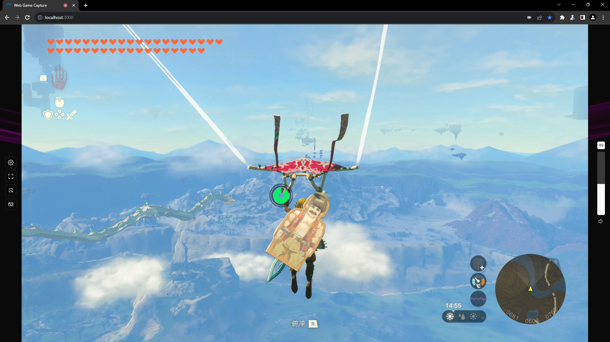
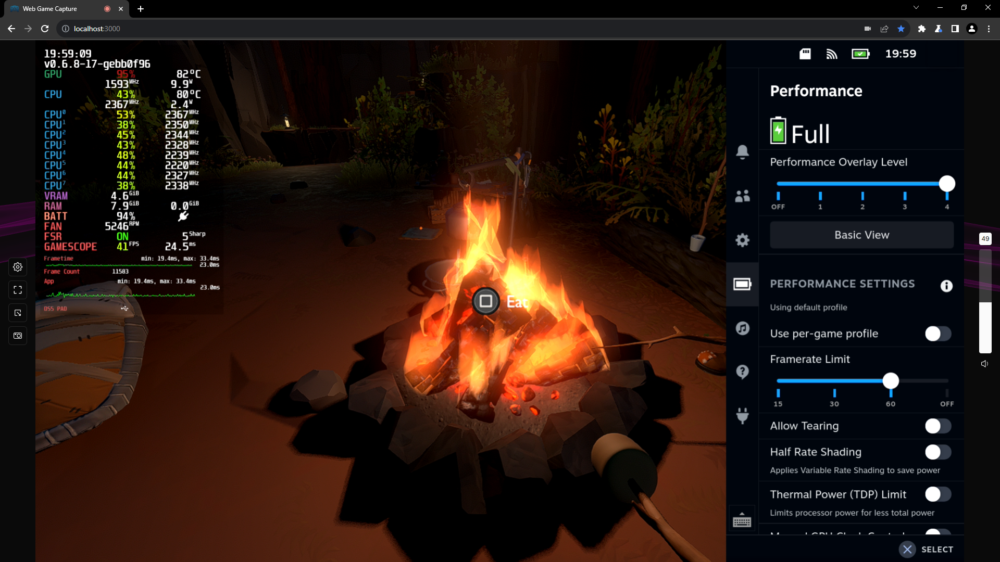

<h1 align="center">
   
  
   
   
  Web Game Capture
   
   
</h1>

[EN] <a href="https://github.com/let-lc/WebGameCapture/blob/main/docs/README_ZH.md">[中文]</a>

This project is a web application built with React.js that enables you to play games on your console through a video capture device, all within your browser. It eliminates the need for installing specific software associated with your capture device or a universal capture software like OBS. By leveraging the [Media Capture and Streams API](https://developer.mozilla.org/en-US/docs/Web/API/Media_Capture_and_Streams_API) of modern browsers, this application captures both video and audio inputs, providing a seamless gaming experience on your PC.

# Features

- Web-based, no Installation
- Local-Only, static site with no backend
- Works with UVC and PCIE video capture devices
- Screenshot Function
- Picture-in-Picture Mode
- Dark Mode UI
- Localization (English and Chinese currently)

# Screenshots

> Nintendo Switch (PCIE Capture Card)

> Steam Deck (PCIE Capture Card)

> PlayStation Vita (USB Video Class)

# License

Licensed under the [MIT license](https://github.com/let-lc/WebGameCapture/blob/main/LICENSE).
