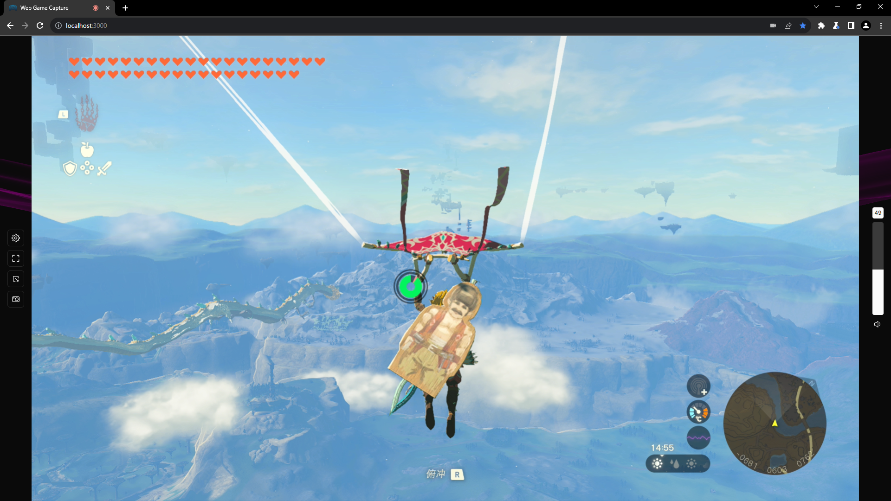
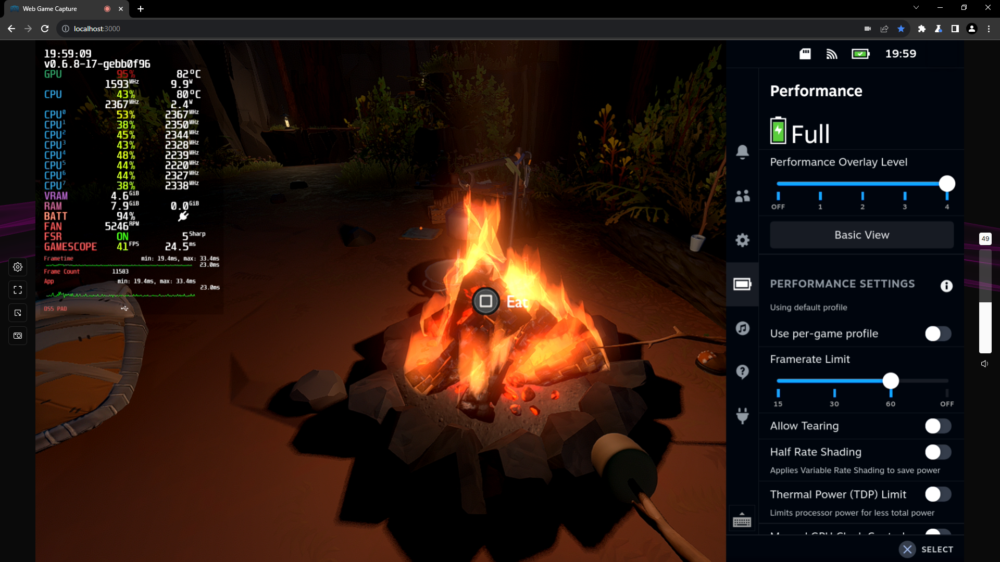
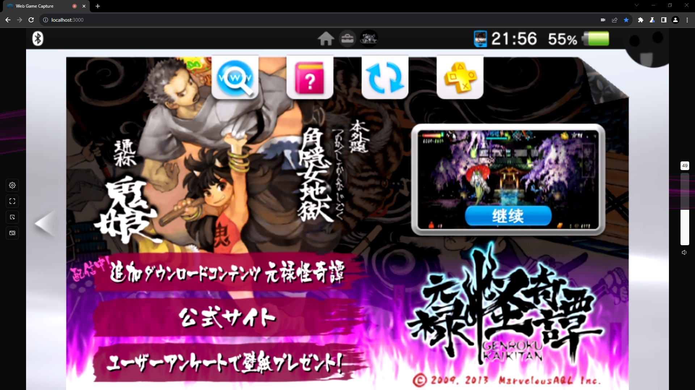

<h1 align="center">
   
  
   
   
  Web Game Capture
   
   
</h1>

<a href="https://github.com/let-lc/WebGameCapture#readm">[EN]</a> [中文]

该项目是一个使用 React.js 构建的网页应用，可让你在浏览器中通过视频采集设备在游戏主机上玩游戏。您无需安装与采集设备相关的特定软件或 OBS 等通用采集录制软件。通过利用现代浏览器的[媒体捕获和流API](https://developer.mozilla.org/zh-CN/docs/Web/API/Media_Capture_and_Streams_API)，可以捕获视频和音频输入，从而在电脑上提供无缝的游戏体验。

# 功能

- 纯网页端, 无安装
- 纯本地静态网页无后端
- 兼容UVC和PCIE采集设备
- 截图功能
- 画中画模式
- 深色模式UI
- 本地化 (暂时只有中文和英文)

# 截图

> Nintendo Switch (PCIE 采集卡)

> Steam Deck (PCIE 采集卡)

> PlayStation Vita (USB视频类)

# 许可证

采用 [MIT 许可证](https://github.com/let-lc/WebGameCapture/blob/main/LICENSE) 授权。
